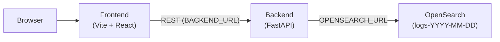
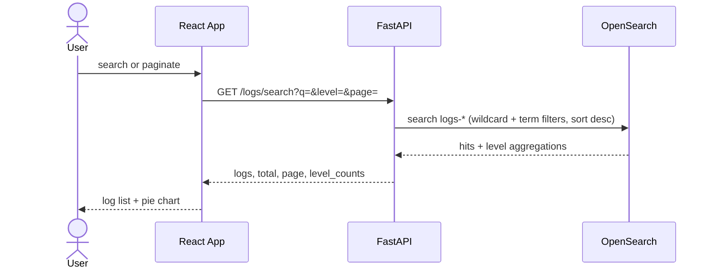
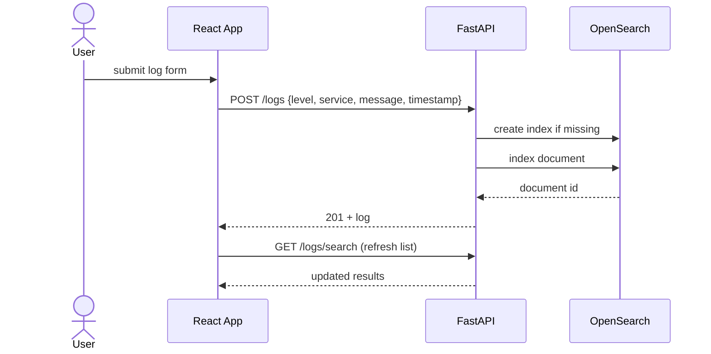
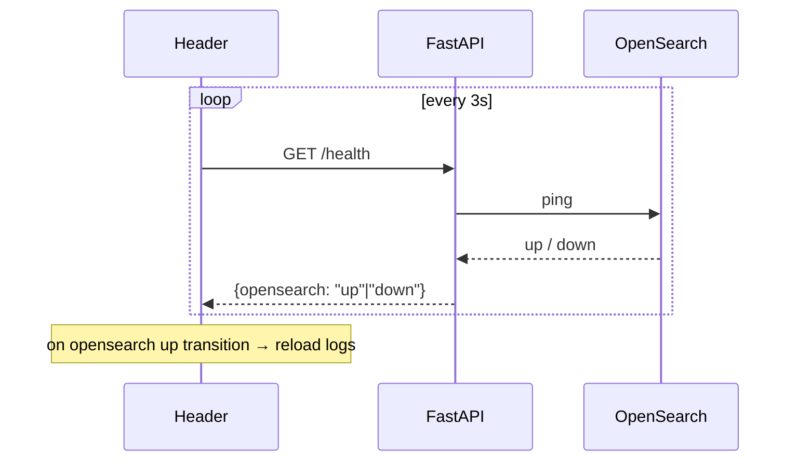
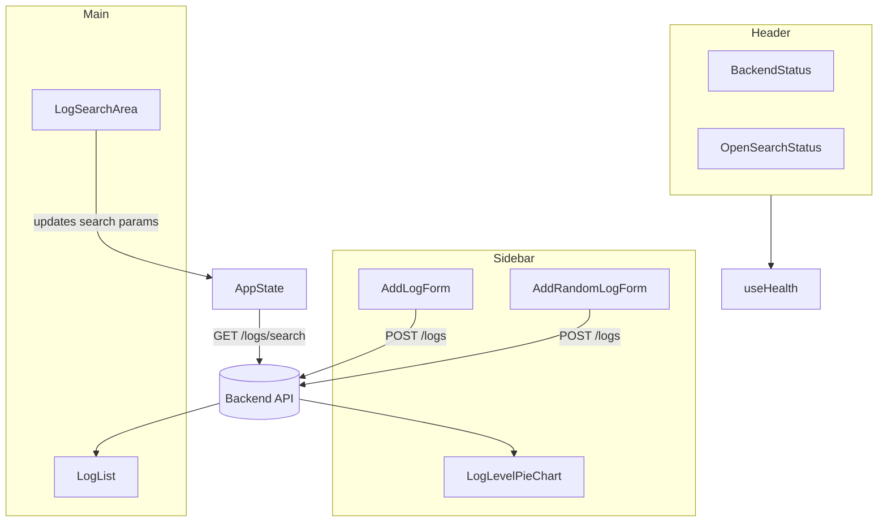

# log-search

A small log viewer with search, built with FastAPI, React, and OpenSearch. Add logs through the UI, filter by text and level, and browse paginated results.

## Prerequisites

- [Docker](https://docs.docker.com/get-docker/) and Docker Compose
- [Make](https://www.gnu.org/software/make/) (optional)

## Quick start

```bash
git clone https://github.com/thenry42/log-search.git
cd log-search
cp .env.example .env
make build
make start
```

Open the frontend at `http://localhost:<FRONTEND_PORT>` (see `.env`). The API is at `http://localhost:<BACKEND_PORT>`.

## Configuration

Copy `.env.example` to `.env` and set the ports. All services read from this file. Feel free to change any of the variables.

| Variable | Description |
| --- | --- |
| `FRONTEND_PORT` | Port for the React dev server (e.g. `5173`) |
| `BACKEND_PORT` | Port for the FastAPI API (e.g. `8000`) |
| `BACKEND_URL` | URL the frontend uses to reach the API (`http://localhost:<BACKEND_PORT>`) |
| `OPENSEARCH_PORT` | Port exposed for OpenSearch (e.g. `9200`) |
| `OPENSEARCH_URL` | URL the backend uses to reach OpenSearch (`http://opensearch-node:<OPENSEARCH_PORT>`) |

Example `.env`:

```bash
FRONTEND_PORT=5173
BACKEND_PORT=8000
BACKEND_URL=http://localhost:8000
OPENSEARCH_PORT=9200
OPENSEARCH_URL=http://opensearch-node:9200
```

## Usage

The Makefile wraps common Docker Compose commands:

```bash
make help     # list all commands
make build    # build images
make start    # start in background
make logs     # follow logs
make down     # stop containers
make clean    # stop and remove volumes (deletes stored logs)
```

Without Make:

```bash
docker compose build
docker compose up -d
docker compose logs -f
docker compose down
```

## How it works

### Architecture

Three Docker services talk over HTTP. The React app calls the FastAPI backend; the backend reads and writes log documents in OpenSearch.



### API surface

| Method | Route | Purpose |
| --- | --- | --- |
| `GET` | `/` | Backend liveness |
| `GET` | `/health` | Backend + OpenSearch status |
| `POST` | `/logs` | Create a log entry |
| `GET` | `/logs/search` | Search, filter, and paginate logs |

### Search flow

Every change in the search area (text or level filter) or page navigation triggers `GET /logs/search`. The backend builds an OpenSearch query, returns the last 20 matching logs (newest first), total hit count, and per-level aggregates for the pie chart.



### Add log flow

Submitting the add-log form sends a JSON payload to `POST /logs`. The backend ensures today's index exists (`logs-YYYY-MM-DD`), indexes the document, then the UI reloads search results.



### Health checks

The header polls `GET /health` every 3 seconds. When OpenSearch comes back up after being down, the app automatically reloads logs so data appears without a manual refresh.



### Frontend layout


